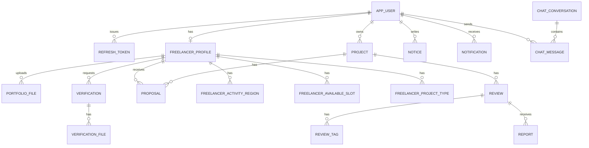

# 안심동행 Frontend

안심동행 프론트엔드 저장소입니다. React와 Svelte를 함께 사용하는 Vite 기반 SPA로, 사용자 인증, 프리랜서 탐색, 프로젝트 요청, 제안 관리, 리뷰/신고, 알림, 채팅, AI 메이트 추천 화면을 제공합니다.

- Frontend Repository: [AIBE5_Project2_Team4_FE](https://github.com/prgrms-aibe-devcourse/AIBE5_Project2_Team4_FE)
- Backend Repository: [AIBE5_Project2_Team4_BE](https://github.com/prgrms-aibe-devcourse/AIBE5_Project2_Team4_BE)
- 기본 API 서버: `http://localhost:8080`
- 기본 개발 서버: `http://localhost:5173`

## 1. 프로젝트 개요

안심동행은 동행/돌봄 서비스가 필요한 사용자가 프로젝트를 등록하고, 검증된 프리랜서 메이트와 연결될 수 있도록 지원하는 매칭 플랫폼입니다.

프론트엔드는 다음 사용자 흐름을 담당합니다.

| 구분 | 주요 기능 |
| --- | --- |
| 인증 | 일반 로그인/회원가입, 카카오 OAuth 로그인, JWT 저장/갱신, 비밀번호 재설정 |
| 메이트 탐색 | 공개 프리랜서 목록/상세 조회, 지역/서비스 유형 필터, 프로필 조회 |
| AI 매칭 | 서비스 유형, 지역, 시간대 조건 기반 메이트 추천 요청 및 추천 사유 표시 |
| 프로젝트 | 프로젝트 생성/목록/상세/수정, 취소/시작/완료 상태 변경 |
| 제안 | 프로젝트별 제안 목록, 프리랜서 제안 수락/거절 |
| 리뷰/신고 | 양방향 리뷰 작성/수정/삭제, 받은 리뷰 조회, 리뷰 신고 |
| 마이페이지 | 내 정보, 프리랜서 프로필, 포트폴리오 파일, 인증 요청 관리 |
| 커뮤니케이션 | 알림 목록/읽음 처리, 채팅 위젯, 공지사항 조회 |

## 2. 역할 분담

| 이름 | 역할 |
| --- | --- |
| 이상민 | 풀스택 |
| 김진필 | 백엔드 |
| 나윤하 | 백엔드, QA, 문서관리 |
| 최용성 | 백엔드 |

## 3. 브랜치 전략 & 커밋 규칙

### 브랜치 전략

| 브랜치 | 용도 |
| --- | --- |
| `main` | 배포 및 최종 통합 브랜치 |
| `feature/*` | 신규 기능 개발 |
| `fix/*` | 버그 수정 |
| `refactor/*` | 기능 변화 없는 구조 개선 |
| `docs/*` | 문서 수정 |
| `test/*` | 테스트 코드 및 검증 보강 |

개발 흐름은 `main`에서 작업 브랜치를 생성한 뒤 PR로 병합하는 방식을 기준으로 합니다. 기능 단위로 브랜치를 작게 유지하고, 프론트엔드와 백엔드가 함께 변경되는 기능은 동일한 기능명 브랜치를 각 저장소에 맞춰 생성합니다.

### 커밋 규칙

커밋 메시지는 다음 형식을 사용합니다.

```text
type: 변경 내용 요약
```

| 타입 | 의미 |
| --- | --- |
| `feat` | 신규 기능 |
| `fix` | 버그 수정 |
| `refactor` | 리팩터링 |
| `docs` | 문서 변경 |
| `test` | 테스트 추가/수정 |
| `chore` | 빌드, 설정, 의존성 등 기타 작업 |
| `style` | 포맷팅, CSS 등 동작 변화 없는 스타일 작업 |

예시:

```text
feat: AI 메이트 추천 화면 추가
fix: 프로젝트 상태 변경 버튼 노출 조건 수정
docs: README 프로젝트 구조 갱신
```

## 4. 기술 스택

| 영역 | 기술 |
| --- | --- |
| Runtime | Node.js, npm |
| Build Tool | Vite 8 |
| Language | TypeScript |
| UI | React 19, React DOM 19, Svelte 5 |
| Styling | CSS Modules가 아닌 페이지별 CSS 파일 |
| API 통신 | Fetch API 기반 자체 `requestJson`, `requestBlob` 클라이언트 |
| 인증 연동 | JWT Bearer Token, LocalStorage, Kakao JavaScript SDK |
| 품질 도구 | ESLint, TypeScript Compiler |

## 5. 프로젝트 구조

```text
AIBE5_Project2_Team4_FE/
├─ public/                  # 정적 리소스
├─ docs/                    # 프론트/백엔드 연동 문서
├─ src/
│  ├─ api/                  # 백엔드 REST API 클라이언트
│  ├─ auth/                 # 인증 세션, 토큰 저장소, 카카오 OAuth 유틸
│  ├─ components/           # 공통 헤더, 채팅 위젯
│  ├─ store/                # 인증/프로젝트/제안/리뷰/채팅/알림 상태 관리
│  ├─ lib/                  # 에러 처리, 라벨/참조 데이터 유틸
│  ├─ data/                 # 지역 정적 데이터
│  ├─ mainpage/             # 메인 화면(Svelte)
│  ├─ loginpage/            # 로그인, 카카오 콜백, 비밀번호 재설정
│  ├─ registerpage/         # 회원가입
│  ├─ freelancerpage/       # 프리랜서 목록/상세
│  ├─ projectpage/          # 프로젝트 및 제안 관리
│  ├─ mypage/               # 마이페이지, 인증, 리뷰, 신고 내역
│  ├─ aimatchpage/          # AI 메이트 추천
│  ├─ announcementpage/     # 공지사항
│  ├─ errorpage/            # 오류 화면
│  └─ main.tsx              # 라우팅 및 앱 부트스트랩
├─ package.json
├─ vite.config.ts
└─ README.md
```

관련 백엔드 저장소는 [AIBE5_Project2_Team4_BE](https://github.com/prgrms-aibe-devcourse/AIBE5_Project2_Team4_BE)입니다. 프론트엔드의 `src/api/*` 모듈은 백엔드의 `/api/v1/*` 엔드포인트와 1:1에 가깝게 대응합니다.

## 6. 필요한 환경 변수 예시

`.env.example`을 복사해 `.env`를 생성합니다.

```bash
cp .env.example .env
```

```env
VITE_API_BASE_URL=http://localhost:8080

# Kakao Developers > App > Platform key > JavaScript key
VITE_KAKAO_JAVASCRIPT_KEY=your-kakao-javascript-key

# Kakao Developers > Kakao Login > Redirect URI에 등록 필요
VITE_KAKAO_REDIRECT_URI=http://localhost:5173/login/kakao/callback

# 선택값. 기본값: account_email,profile_nickname
VITE_KAKAO_SCOPE=account_email,profile_nickname

# 선택값. 기본값: Kakao JavaScript SDK 2.7.6 CDN
VITE_KAKAO_SDK_URL=https://t1.kakaocdn.net/kakao_js_sdk/2.7.6/kakao.min.js
```

## 7. ERD / DB 구조

프론트엔드는 DB를 직접 소유하지 않고 백엔드 API를 통해 데이터를 조회/변경합니다. 실제 DB 스키마는 백엔드 저장소의 JPA 엔티티 기준이며, 핵심 관계는 다음과 같습니다.



주요 테이블은 `APP_USER`, `FREELANCER_PROFILE`, `PROJECT`, `PROPOSAL`, `REVIEW`, `REPORT`, `VERIFICATION`, `NOTICE`, `NOTIFICATION`, `CHAT_CONVERSATION`, `CHAT_MESSAGE`입니다. 상세 컬럼과 제약은 [백엔드 README](https://github.com/prgrms-aibe-devcourse/AIBE5_Project2_Team4_BE#7-erd--db-%EA%B5%AC%EC%A1%B0)를 기준으로 확인합니다.

## 8. API 명세

프론트엔드는 `src/api/client.ts`의 공통 클라이언트를 통해 `ApiResponse<T>` 응답을 자동 언래핑합니다. 인증이 필요한 요청은 LocalStorage의 access token을 `Authorization: Bearer <token>` 헤더로 전송하고, 401 응답 시 refresh token 기반 재발급을 시도합니다.

백엔드 Swagger UI:

```text
http://localhost:8080/swagger-ui/index.html
```

| 프론트 모듈 | 백엔드 경로 | 설명 |
| --- | --- | --- |
| `auth.ts` | `/api/v1/auth/*` | 로그인, 회원가입, 카카오 OAuth, 토큰 갱신, 로그아웃, 비밀번호 재설정 |
| `users.ts` | `/api/v1/users/*` | 내 프로필, 마이페이지, 공개 사용자 프로필 |
| `freelancers.ts` | `/api/v1/freelancers/*` | 프리랜서 목록/상세, 내 프리랜서 프로필, 포트폴리오 파일 |
| `projects.ts` | `/api/v1/projects/*` | 프로젝트 생성/조회/수정/취소/시작/완료 |
| `proposals.ts` | `/api/v1/projects/{projectId}/proposals`, `/api/v1/freelancers/me/proposals` | 제안 생성, 제안 목록, 수락/거절 |
| `reviews.ts` | `/api/v1/projects/*/reviews`, `/api/v1/users/me/reviews`, `/api/v1/freelancers/*/reviews` | 리뷰 작성/조회/수정/삭제, 태그 코드 |
| `reports.ts` | `/api/v1/reviews/{reviewId}/reports`, `/api/v1/reports/me` | 리뷰 신고, 내 신고 내역 |
| `verifications.ts` | `/api/v1/freelancers/me/verifications/*` | 프리랜서 인증 요청 및 파일 관리 |
| `notifications.ts` | `/api/v1/notifications/*` | 알림 목록, 상세, 읽음, 전체 읽음, 삭제 |
| `chats.ts` | `/api/v1/chats/*` | 채팅방 생성/목록, 메시지 조회/전송, 읽음 처리 |
| `notices.ts` | `/api/v1/notices/*` | 공지사항 목록/상세 |
| `codes.ts` | `/api/v1/codes/*` | 프로젝트 유형, 지역, 가능 시간대 코드 |
| `files.ts` | `/api/v1/files/*` | 파일 조회 및 다운로드 URL |
| `admin.ts` | `/api/v1/admin/*` | 관리자 대시보드, 인증 심사, 프로젝트/프리랜서/리뷰/신고/공지 관리 |
| `recommendations.ts` | `/api/v1/recommendations/freelancers/public` | AI 메이트 추천 요청 |

## 9. 테스트 방법

### 설치

```bash
npm install
```

### 개발 서버 실행

```bash
npm run dev
```

### 정적 검사

```bash
npm run lint
```

### 프로덕션 빌드

```bash
npm run build
```

### 빌드 결과 미리보기

```bash
npm run preview
```

프론트엔드 전용 테스트 스크립트는 현재 `package.json`에 정의되어 있지 않습니다. 화면/연동 검증은 백엔드를 `localhost:8080`에서 실행한 뒤 Vite 개발 서버에서 주요 사용자 흐름을 확인합니다.

## 10. 트러블슈팅

추후 추가 예정

## 11. 향후 개선 방향

- AI 매칭 고도화 및 추천 이유 출력
- 채팅 암호화 적용
- 알림 시스템 확장
